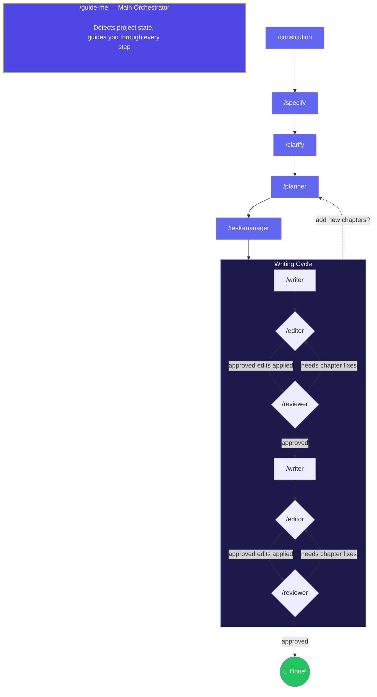

# Novel Writer English — Open-Source AI Novel Writing Assistant

> A free, open-source AI novel writing system that helps authors plan, draft, edit, review, and complete novels using a structured eight-step workflow.
>
> Works with **Claude Code**, **Gemini CLI**, **OpenCode**, **Codex CLI**, ChatGPT, and any AI chat assistant.

[](https://opensource.org/licenses/MIT)
[](https://www.npmjs.com/package/novel-writer-english)

## What is Novel Writer English?

Novel Writer English is an AI-powered novel writing assistant for authors who want more structure than a single prompt can provide. Instead of asking AI to generate an entire book at once, it guides you through a complete fiction-writing workflow: creative principles, story specification, clarification, chapter planning, task management, drafting, chapter editing, and broad review.

This project is designed for writers using AI tools such as **Claude Code**, **Gemini CLI**, **OpenCode**, **Codex CLI**, ChatGPT, or any copy-paste AI assistant. It helps maintain story consistency, character depth, pacing, worldbuilding, and prose quality across long-form fiction projects.

Novel Writer English is completely free, open-source, platform-agnostic, and based on an eight-step methodology adapted from the original [novel-writer-skills](https://github.com/wordflowlab/novel-writer-skills) project by [wordflowlab](https://github.com/wordflowlab).

## Key Features

- **Eight-step AI novel writing workflow** from concept to completed manuscript
- **AI-assisted chapter drafting** with a 13-item pre-write checklist
- **Built-in editor workflow** for one-chapter line fixes, approval tracking, and controlled revisions
- **Built-in reviewer workflow** for broad consistency, tracking, story health, and final readiness
- **Character, plot, timeline, and relationship tracking**
- **Genre-specific writing knowledge** for fantasy, horror, mystery, romance, sci-fi, and thriller
- **Works with Claude Code, Gemini CLI, OpenCode, Codex CLI, ChatGPT, and any AI chat tool**
- **Free, open-source, and platform-agnostic**

## Quick Install

Run this in your novel project root:

```bash
npx novel-writer-english
```

The interactive installer will ask which AI tools you use and set up commands, skills, and templates automatically.

## AI Novel Writing Workflow



### Step-by-Step Workflow

| # | Command | Purpose |
|---|---------|---------|
| 0 | `/guide-me` | **Main orchestrator** — start here. Detects your project state and guides you through every step. |
| 1 | `/constitution` | Define core creative principles, pacing strategy, and character depth approach. |
| 2 | `/specify` | Build a lean story specification and map details into knowledge files. |
| 3 | `/clarify` | Resolve ambiguities in the spec with targeted questions. |
| 4 | `/planner` | Create chapter structure, pacing, foreshadowing plan, and character arc mapping. |
| 5 | `/task-manager` | Break the plan into prioritized, dependency-tracked writing tasks. |
| 6 | `/writer` | Write chapters with a 13-item pre-write checklist to maintain consistency. |
| 7 | `/editor` | Check one chapter, propose line-level fixes, track approvals, and apply approved edits only after confirmation. |
| 8 | `/reviewer` | Run broad QA for project health, cross-chapter consistency, tracking accuracy, and final readiness. |

The writing cycle, steps 6–8, repeats for each chapter or chapter batch. You can loop back to `/planner` or `/task-manager` at any time to add new chapters or restructure your novel.

## All AI Novel Writing Commands

### Core Workflow

| Command | Description |
|---------|-------------|
| `/guide-me` | Main orchestrator. Walks you through the eight-step AI novel writing methodology from concept to completed manuscript. |
| `/constitution` | Step 1 — Creates or updates the creative constitution, including core values, quality baseline, style principles, pacing, and character depth. |
| `/specify` | Step 2 — Builds a lean story specification and initializes detailed knowledge files. |
| `/clarify` | Step 3 — Reviews the spec, identifies up to five ambiguities, and asks targeted questions. |
| `/planner` | Step 4 — Creates chapter structure, pacing, foreshadowing plan, and character arc mapping. |
| `/task-manager` | Step 5 — Breaks the creative plan into prioritized, dependency-tracked writing tasks. |
| `/writer` | Step 6 — Provides AI-assisted writing with Write Mode, Draft Detection, and a 13-item pre-write checklist. |
| `/editor` | Step 7 — Reviews one chapter, proposes line-specific edits, tracks approval status, and applies approved changes only after confirmation. |
| `/reviewer` | Step 8 — Performs broad QA for framework consistency, cross-chapter continuity, tracking accuracy, and final readiness. |

### Utilities

| Command | Description |
|---------|-------------|
| `/meta` | Records novel metadata, including title, author, genre, tags, status, and publication dates, to `meta.json`. |
| `/checklist` | Runs a quality checklist against the current context or chapter. |
| `/expert` | Activates expert mode for deep, specialized analysis, such as editor, sensitivity reader, or logic checker. |
| `/track-init` | Initializes the JSON tracking system for a new novel. |
| `/track` | Updates or queries the comprehensive tracking system. |
| `/timeline` | Manages the story timeline and verifies chronological consistency. |
| `/relations` | Manages and analyzes character relationships. |
| `/authenticity-audit` | Audits text for AI-generated stylistic patterns and clichés. |
| `/authentic-voice` | Rewrites a passage to remove AI clichés and enforce authentic human voice. |
| `/utility-command-cross-check` | Compares a project file created by a command against the current workflow format and suggests revision when stale. |

## Auto-Activating AI Writing Skills

Skills are passive knowledge files that the AI loads automatically when your prompt matches their domain. No manual invocation is needed.

### Writing Techniques

| Skill | Description |
|-------|-------------|
| `character-depth` | Ensures deep psychological backstory, Wound/Ghost, internal contradictions, defense mechanisms, and vulnerability triggers. |
| `comedic-banter-rhythm` | Shapes witty banter, comedic escalation, argument-driven exposition, and humor under pressure. |
| `dialogue-techniques` | Makes dialogue subtext-heavy, distinctive, and character-driven. |
| `emotional-interiority` | Ensures internal reactions, sensory-emotional responses, and prevents report-style narration. |
| `namecraft` | Suggests names for characters, factions, places, titles, abilities, systems, artifacts, arcs, and concepts using genre, faction, symbolism, humor, and source links. |
| `pacing-rhythm` | Enforces chosen pacing archetypes, manages sentence-level rhythm, and detects fragment overuse. |
| `punctuation-emotional-effect` | Uses punctuation deliberately for emotion, rhythm, hesitation, interruption, silence, and intensity. |
| `scene-structure` | Ensures scenes follow strong structural principles: Goal, Conflict, Disaster, Reaction, Dilemma, and Decision. |
| `strategic-reversal` | Designs contests, tactics, bluffs, hidden rules, clever wins, and fair-but-surprising reversals. |

### Quality Assurance

| Skill | Description |
|-------|-------------|
| `consistency-checker` | Checks for plot holes, character inconsistencies, timeline errors, and constitution violations. |
| `forgotten-elements` | Identifies dropped plot threads and forgotten characters or items. |
| `getting-started` | Helps overcome blank page syndrome by generating prompts and initial hooks. |
| `pre-write-checklist` | Ensures the AI loads constitution, specification, plan, and context before drafting a chapter. |
| `requirement-detector` | Detects and enforces specific plot or content requirements, such as fast-paced or high-emotion scenes. |
| `setting-detector` | Detects the genre setting and loads the appropriate knowledge base. |
| `workflow-guide` | Orchestrates the eight-step methodology and coordinates sub-skills. |

### Genre Knowledge

| Skill | Description |
|-------|-------------|
| `genre-knowledge/fantasy` | Fantasy tropes, magic systems, worldbuilding, and narrative structures. |
| `genre-knowledge/horror` | Dread, atmosphere, psychological tension, fear escalation, and horror pacing. |
| `genre-knowledge/mystery` | Mystery plotting, clue dropping, red herrings, reveal timing, and tension escalation. |
| `genre-knowledge/romance` | Romance arcs, emotional intimacy, romantic tension, and genre-standard tropes. |
| `genre-knowledge/scifi` | Science fiction worldbuilding, technology, speculative themes, and future societies. |
| `genre-knowledge/thriller` | High-stakes pacing, suspense, ticking clocks, escalation, and tension. |

### Specialized Skills

| Skill | Description |
|-------|-------------|
| `novel-cover-art-creation` | Crafts detailed AI image generation prompts for novel cover art using ChatGPT Image, Midjourney, DALL-E, or similar tools. |
| `chapter-illustration-prompter` | Generates chapter illustration prompt files with scene-specific prompts and technical notes. |
| `novel-uploader-guidelines-r2` | Provides guidelines for formatting novel content for Cloudflare R2 upload and web novel viewer apps. |

## Knowledge and Tracking Files

These files are created automatically from templates during the workflow and updated as you write.

### Memory Files

| File | Purpose |
|------|---------|
| `memory/constitution.md` | Stores your creative principles, non-negotiables, and quality baseline. |
| `memory/personal-voice.md` | Stores your unique writing voice preferences and stylistic patterns. |

### Knowledge Files

| File | Purpose |
|------|---------|
| `stories/[name]/knowledge/character-profiles.md` | Stores detailed character profiles with psychological depth. |
| `stories/[name]/knowledge/character-voices.md` | Tracks speech patterns, banter roles, exposition roles, humor style, pressure response, and status behavior. |
| `stories/[name]/knowledge/locations.md` | Stores setting descriptions, sensory details, and spatial relationships. |
| `stories/[name]/knowledge/world-setting.md` | Tracks worldbuilding rules, magic systems, technology, and cultural details. |
| `stories/[name]/knowledge/glossary.md` | Stores terms, titles, factions, items, magic/technology names, and in-world vocabulary. |
| `stories/[name]/knowledge/strategic-reversals.md` | Tracks contest rules, tactics, opponent assumptions, hidden levers, and clever reversal setups. |

### Tracking Files

| File | Purpose |
|------|---------|
| `stories/[name]/tracking/character-state.json` | Tracks character arcs, emotional states, and physical conditions per chapter. |
| `stories/[name]/tracking/plot-tracker.json` | Tracks plot threads, subplots, and resolution status. |
| `stories/[name]/tracking/relationships.json` | Tracks character relationship dynamics and how they evolve. |
| `stories/[name]/tracking/timeline.json` | Tracks chronological story events for consistency checking. |
| `stories/[name]/tracking/validation-rules.json` | Stores custom validation rules derived from your constitution. |

## Project File Structure

After running `npx novel-writer-english` and starting your workflow, your project root looks like this:

```text
my-novel/
├── .claude/                    # Claude Code commands and skills, if selected
│   ├── commands/
│   └── skills/
├── .gemini/                    # Gemini CLI commands and skills, if selected
│   ├── commands/novel/
│   └── skills/
├── .opencode/                  # OpenCode commands and skills, if selected
│   ├── commands/novel/
│   └── skills/
├── .agents/                    # Codex CLI skills, if selected
│   └── skills/
├── memory/                     # Created by /constitution
│   ├── constitution.md
│   └── personal-voice.md
├── stories/                    # Created by /specify
│   └── [your-novel-name]/
│       ├── specification.md
│       ├── creative-plan.md
│       ├── tasks.md
│       ├── meta.json
│       ├── knowledge/          # Created by /specify
│       │   ├── character-profiles.md
│       │   ├── character-voices.md
│       │   ├── glossary.md
│       │   ├── locations.md
│       │   ├── strategic-reversals.md
│       │   └── world-setting.md
│       ├── tracking/           # Created by /planner or /track-init
│       │   ├── character-state.json
│       │   ├── plot-tracker.json
│       │   ├── relationships.json
│       │   ├── timeline.json
│       │   └── validation-rules.json
│       └── content/
│           ├── chapter-01.md
│           ├── chapter-02.md
│           └── ...
```

> **Note:** You only need to create the project folder and run the installer. Everything else, including `memory/`, `stories/[name]/knowledge/`, `stories/[name]/tracking/`, and all generated `.md` and `.json` files, is created automatically by the commands as you work through the eight-step workflow.

## Supported AI Writing Platforms

| Platform | Commands | Skills | Installer Target |
|----------|----------|--------|-----------------|
| **Claude Code** | `.claude/commands/*.md` | `.claude/skills/` | `./claude/` |
| **Gemini CLI** | `.gemini/commands/novel/*.toml` | `.gemini/skills/` | `./gemini/` |
| **OpenCode** | `.opencode/commands/novel/*.md` | `.opencode/skills/` | `./opencode/` |
| **Codex CLI** | `.agents/skills/commands/*/SKILL.md` | `.agents/skills/` | `./agents/` |
| **Any AI Assistant** | Copy-paste from `src/commands/` | — | Manual |

## Who Is This For?

Novel Writer English is built for fiction writers, indie authors, web novel creators, and AI-assisted writing workflows. It is especially useful if you want to:

- Plan a novel before drafting
- Keep characters, plot threads, and timelines consistent
- Use AI without losing control of your creative direction
- Write long-form fiction with Claude Code, Gemini CLI, OpenCode, Codex CLI, ChatGPT, or another AI assistant
- Build repeatable workflows for novels, series, or web fiction projects

## Use Cases

Novel Writer English can help with:

- AI-assisted novel planning
- Chapter-by-chapter fiction drafting
- Long-form story consistency tracking
- Character arc management
- Worldbuilding organization
- Web novel production workflows
- AI-assisted editing and review
- Genre-aware fiction writing
- Maintaining author voice while using AI

## Keywords

AI novel writing assistant, open-source novel writing tool, AI fiction writing workflow, Claude Code novel writing, Gemini CLI writing assistant, OpenCode writing workflow, Codex CLI writing assistant, AI story planner, AI chapter writer, novel planning tool, fiction writing system, AI-assisted writing, web novel writing tool, long-form fiction AI workflow.

## Attribution

This project is a translation and re-architecture of the original work by [wordflowlab](https://github.com/wordflowlab). The original [novel-writer-skills](https://github.com/wordflowlab/novel-writer-skills) repository provided the foundational methodology, skill architecture, and command templates that this project builds upon.

## License

MIT
