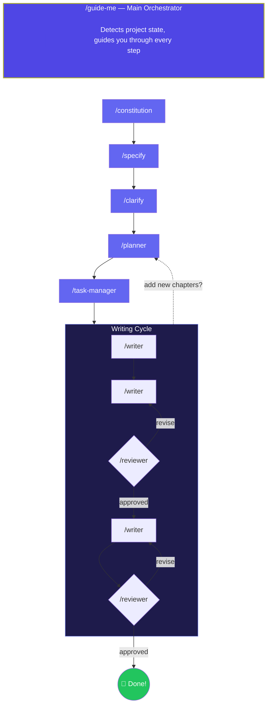

# Novel Writer English — AI-Powered Novel Writing System

> Free, open-source, seven-step methodology for writing novels with any AI assistant.
> English translation and re-architecture of [novel-writer-skills](https://github.com/wordflowlab/novel-writer-skills) by [wordflowlab](https://github.com/wordflowlab).

[](https://opensource.org/licenses/MIT)
[](https://www.npmjs.com/package/novel-writer-english)

## What is this?

Novel Writer English transforms standard AI chat interfaces into a structured, step-by-step novel writing assistant. Rather than generating a novel in one go, it guides you through a proven seven-step workflow — from establishing core principles to executing chapters with a built-in pre-write checklist that prevents AI context degradation.

Completely free, open-source, and platform-agnostic. Works with **Claude Code**, **Gemini CLI**, **OpenCode**, **Codex CLI**, or any AI chat via copy-paste.

## Quick Install

Run this in your novel project root:

```bash
npx novel-writer-english
```

The interactive installer will ask which AI tools you use and set up commands, skills, and templates automatically.

## The Workflow



### Step-by-Step

| # | Command | Purpose |
|---|---------|---------|
| 0 | `/guide-me` | **Main orchestrator** — start here. Detects your project state and guides you through every step. |
| 1 | `/constitution` | Define core creative principles, pacing strategy, and character depth approach. |
| 2 | `/specify` | Build the story specification (logline → premise → one-page → full spec). |
| 3 | `/clarify` | Resolve ambiguities in the spec with targeted questions. |
| 4 | `/planner` | Create chapter structure, pacing, foreshadowing plan, and character arc mapping. |
| 5 | `/task-manager` | Break the plan into prioritized, dependency-tracked writing tasks. |
| 6 | `/writer` | Write chapters with a 12-item pre-write checklist to maintain consistency. |
| 7 | `/reviewer` | Quality analysis — checks consistency, constitution compliance, and prose quality. |

The writing cycle (steps 6–7) repeats for each chapter. You can loop back to `/planner` or `/task-manager` at any time to add new chapters or restructure.

## All Commands

### Core Workflow

| Command | Description |
|---------|-------------|
| `/guide-me` | Main orchestrator. Walks you through the seven-step methodology from concept to completed manuscript. |
| `/constitution` | Step 1 — Creates or updates the creative constitution (core values, quality baseline, style principles, pacing, character depth). |
| `/specify` | Step 2 — Builds the story specification using a progressive 4-level approach. |
| `/clarify` | Step 3 — Reviews the spec, identifies up to 5 ambiguities, and asks targeted questions. |
| `/planner` | Step 4 — Creates chapter structure, pacing, foreshadowing plan, and character arc mapping. |
| `/task-manager` | Step 5 — Breaks the creative plan into prioritized, dependency-tracked writing tasks. |
| `/writer` | Step 6 — AI-assisted writing with Write Mode, Draft Detection, and 12-item pre-write checklist. |
| `/reviewer` | Step 7 — Quality analysis for framework or content consistency and constitution compliance. |

### Utilities

| Command | Description |
|---------|-------------|
| `/meta` | Records novel metadata (title, author, genre, tags, status, publication dates) to `meta.json`. |
| `/checklist` | Run a quality checklist against the current context or chapter. |
| `/expert` | Activate expert mode for deep, specialized analysis (editor, sensitivity reader, logic checker, etc.). |
| `/track-init` | Initialize the JSON tracking system for a new novel. |
| `/track` | Update or query the comprehensive tracking system. |
| `/timeline` | Manage the story timeline and verify chronological consistency. |
| `/relations` | Manage and analyze character relationships. |
| `/authenticity-audit` | Audit text for AI-generated stylistic patterns and clichés. |
| `/authentic-voice` | Rewrite a passage to remove AI clichés and enforce authentic human voice. |

## Skills (Auto-Activating)

Skills are passive knowledge files that the AI loads automatically when your prompt matches their domain. No manual invocation needed.

### Writing Techniques

| Skill | Description |
|-------|-------------|
| `character-depth` | Ensures deep psychological backstory, Wound/Ghost, internal contradictions, defense mechanisms, and vulnerability triggers. |
| `dialogue-techniques` | Makes dialogue subtext-heavy, distinctive, and character-driven. |
| `emotional-interiority` | Ensures internal reactions, sensory-emotional responses, and prevents report-style narration. |
| `pacing-rhythm` | Enforces chosen pacing archetypes, manages sentence-level rhythm, and detects fragment overuse. |
| `scene-structure` | Ensures scenes follow strong structural principles (Goal, Conflict, Disaster, Reaction, Dilemma, Decision). |

### Quality Assurance

| Skill | Description |
|-------|-------------|
| `consistency-checker` | Checks for plot holes, character inconsistencies, timeline errors, and constitution violations. |
| `forgotten-elements` | Identifies dropped plot threads and forgotten characters or items. |
| `getting-started` | Helps overcome blank page syndrome by generating prompts and initial hooks. |
| `pre-write-checklist` | Ensures the AI loads constitution, specification, plan, and context before drafting a chapter. |
| `requirement-detector` | Detects and enforces specific plot or content requirements (fast-paced, high emotion, etc.). |
| `setting-detector` | Detects the genre setting and loads the appropriate knowledge base. |
| `workflow-guide` | Orchestrates the seven-step methodology and coordinates sub-skills. |

### Genre Knowledge

| Skill | Description |
|-------|-------------|
| `genre-knowledge/fantasy` | Fantasy tropes, magic systems, worldbuilding, and narrative structures. |
| `genre-knowledge/horror` | Building dread, atmosphere, and psychological tension. |
| `genre-knowledge/mystery` | Mystery plotting, clue dropping, red herrings, and tension escalation. |
| `genre-knowledge/romance` | Romance arcs, emotional intimacy, tension, and standard tropes. |
| `genre-knowledge/scifi` | Science fiction worldbuilding, technology, and speculative themes. |
| `genre-knowledge/thriller` | High-stakes pacing, suspense, ticking clocks, and tension. |

### Specialized

| Skill | Description |
|-------|-------------|
| `novel-cover-art-creation` | Crafts detailed AI image generation prompts for novel cover art (ChatGPT Image, Midjourney, DALL-E, etc.). |
| `chapter-illustration-prompter` | Generates chapter illustration prompt files with scene-specific prompts and technical notes. |
| `novel-uploader-guidelines-r2` | Guidelines for formatting novel content for Cloudflare R2 upload and web novel viewer apps. |

## Knowledge & Tracking Files

These files are created automatically from templates during the workflow and updated as you write.

### Memory (`memory/`)

| File | Purpose |
|------|---------|
| `constitution.md` | Your creative principles, non-negotiables, and quality baseline. |
| `personal-voice.md` | Your unique writing voice preferences and stylistic patterns. |

### Knowledge (`knowledge/`)

| File | Purpose |
|------|---------|
| `character-profiles.md` | Detailed character profiles with psychological depth. |
| `character-voices.md` | Distinctive speech patterns, vocabulary, and mannerisms per character. |
| `locations.md` | Setting descriptions, sensory details, and spatial relationships. |
| `world-setting.md` | Worldbuilding rules, magic systems, technology, and cultural details. |

### Tracking (`tracking/`)

| File | Purpose |
|------|---------|
| `character-state.json` | Tracks character arcs, emotional states, and physical conditions per chapter. |
| `plot-tracker.json` | Tracks plot threads, subplots, and their resolution status. |
| `relationships.json` | Character relationship dynamics and how they evolve. |
| `timeline.json` | Chronological event timeline for consistency checking. |
| `validation-rules.json` | Custom validation rules derived from your constitution. |

## Project File Structure

After running `npx novel-writer-english` and starting your workflow, your project root looks like this:

```
my-novel/
├── .claude/                    # Claude Code commands & skills (if selected)
│   ├── commands/
│   └── skills/
├── .gemini/                    # Gemini CLI commands & skills (if selected)
│   ├── commands/novel/
│   └── skills/
├── .opencode/                  # OpenCode commands & skills (if selected)
│   ├── commands/novel/
│   └── skills/
├── .agents/                    # Codex CLI skills (if selected)
│   └── skills/
├── memory/                     # Created by /constitution
│   ├── constitution.md
│   └── personal-voice.md
├── knowledge/                  # Created by /specify
│   ├── character-profiles.md
│   ├── character-voices.md
│   ├── locations.md
│   └── world-setting.md
├── tracking/                   # Created by /track-init
│   ├── character-state.json
│   ├── plot-tracker.json
│   ├── relationships.json
│   ├── timeline.json
│   └── validation-rules.json
├── stories/                    # Created by /specify
│   └── [your-novel-name]/
│       ├── specification.md
│       ├── creative-plan.md
│       ├── tasks.md
│       └── content/
│           ├── chapter-01.md
│           ├── chapter-02.md
│           └── ...
└── meta.json                   # Created by /meta
```

> **Note:** You only need to create the project folder and run the installer. Everything else (`memory/`, `knowledge/`, `tracking/`, `stories/`, all `.md` and `.json` files) is **generated automatically** by the commands as you work through the seven steps.

## Platform Support

| Platform | Commands | Skills | Installer Target |
|----------|----------|--------|-----------------|
| **Claude Code** | `.claude/commands/*.md` | `.claude/skills/` | `./claude/` |
| **Gemini CLI** | `.gemini/commands/novel/*.toml` | `.gemini/skills/` | `./gemini/` |
| **OpenCode** | `.opencode/commands/novel/*.md` | `.opencode/skills/` | `./opencode/` |
| **Codex CLI** | — (skills only) | `.agents/skills/` | `./agents/` |
| **Any AI** | Copy-paste from `src/commands/` | — | Manual |

## Attribution

This project is a translation and re-architecture of the original work by [wordflowlab](https://github.com/wordflowlab/novel-writer-skills). The original repository provided the foundational methodology, skill architecture, and command templates that this project builds upon.

## License

MIT
